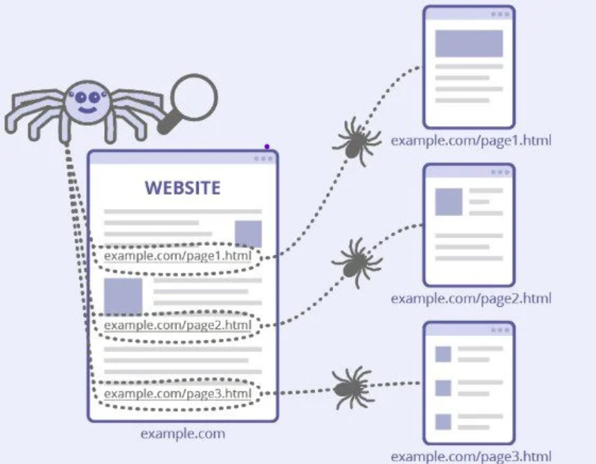
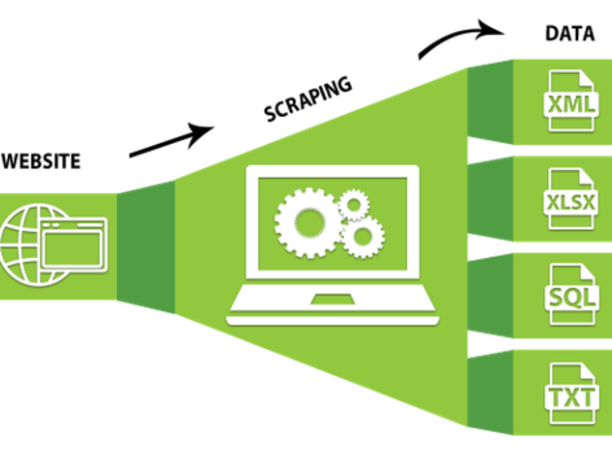
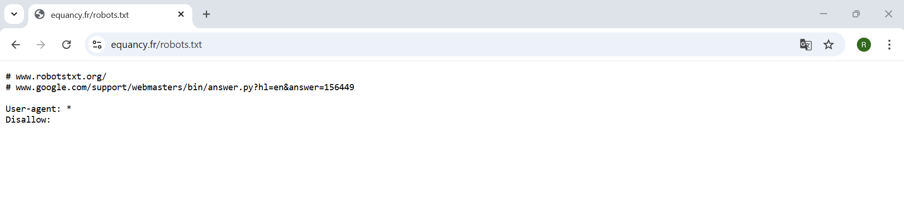
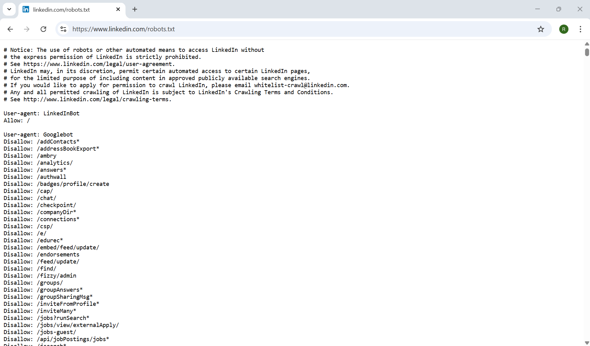

Avant de rentrer dans les aspects techniques, il est important de distinguer trois notions souvent confondues : **crawling**, **scraping** et **automatisation**.

Ces trois concepts sont liés mais ne désignent pas exactement la même chose.

## Le Crawling

Le **crawling** consiste à parcourir automatiquement un site web afin de **découvrir des pages et des liens**.

    

Un crawler (ou robot d’indexation) visite une page web, identifie les liens présents dans cette page, puis visite ces liens à son tour. Ce processus est répété de manière automatique afin d’explorer une grande partie d’un site ou du web.

Le crawling est notamment utilisé par les **moteurs de recherche** pour indexer les pages du web. Par exemple, **Googlebot** parcourt en permanence le web afin de découvrir de nouvelles pages et de mettre à jour l’index de Google. C’est grâce à ce processus que les résultats de recherche sont alimentés et actualisés.

Les étapes :

1. Le crawler visite une page d’accueil
2. Il détecte plusieurs liens vers d’autres pages
3. Il visite ces nouvelles pages
4. Il continue ainsi de proche en proche

Le crawling sert donc principalement à **découvrir et cartographier les pages**.

Au-delà des moteurs de recherche, le crawling est également utilisé pour :

- la **veille concurrentielle** (suivre les nouvelles pages d’un site concurrent)
- l’**archivage du web** (des projets comme la Wayback Machine archivent des milliards de pages)
- la **détection de contenu** (identifier toutes les pages produits d’un site e-commerce avant de les scraper)

## Scraping

Le scraping, ou "web scraping", est une technique utilisée pour extraire automatiquement des données depuis une page web. Cette méthode permet de récupérer des informations structurées ou semi-structurées disponibles sur des pages web, que l'on peut ensuite analyser, traiter ou stocker pour divers usages.

    

Exemples de données souvent scrapées :

- prix de produits
- titres d’articles
- avis clients
- résultats sportifs
- annonces immobilières
- informations publiques

Le scraping repose généralement sur l’analyse de la **structure HTML de la page** afin d’identifier où se trouvent les données à récupérer.

Il existe plusieurs modules et outils permettant de réaliser du scraping : 

* Python : `BeautifulSoup` avec `Requests`, `Selenium`, `Scrapy`, `Playwright`, etc.
* Outils **no-code** : `Phantom Buster`, `Octoparse`...

Le choix de l’outil dépend généralement :

- de la structure des pages web à analyser
- du fait que le contenu soit statique ou généré dynamiquement
- du volume de données à collecter
- de la fréquence d’exécution du scraping
- de la complexité des interactions nécessaires avec le site.

## Automatisation 

L’**automatisation web** consiste à **reproduire automatiquement des actions humaines dans un navigateur**.

    

Cela peut inclure :

- ouvrir un site web
- cliquer sur des boutons
- remplir un formulaire
- se connecter à un compte
- naviguer entre plusieurs pages
- télécharger des fichiers

L’automatisation est souvent utilisée lorsque les données ne peuvent pas être récupérées simplement via le HTML (par exemple lorsque le site nécessite une interaction utilisateur).

Les outils d’automatisation permettent donc de **simuler le comportement d’un utilisateur réel**.

### Automatisation de bureau (RPA)

Au-delà de l’automatisation du navigateur, il existe des outils d’**automatisation des processus robotiques** (RPA — *Robotic Process Automation*) capables d’agir non seulement sur un navigateur web, mais sur **n’importe quelle application du bureau** (Excel, logiciels métiers, portails sans API, etc.).

Les outils RPA les plus répandus sont :

- **UiPath** : plateforme RPA leader du marché, avec une interface visuelle (UiPath Studio) pour créer des workflows d’automatisation sans coder
- **Power Automate Desktop** : solution Microsoft intégrée à Windows 10/11, accessible gratuitement, avec des connecteurs natifs pour l’écosystème Microsoft 365
- **Automation Anywhere** : plateforme cloud-native orientée entreprise, intégrant des capacités d’intelligence artificielle (traitement de documents, etc.)

Dans le contexte du scraping, ces outils peuvent être utiles pour extraire des données depuis des **applications de bureau**, des **portails web sécurisés** ou des **interfaces graphiques** impossibles à atteindre via des requêtes HTTP classiques. Ils permettent notamment d’automatiser des flux de travail hybrides combinant navigation web et manipulation de fichiers ou de logiciels bureautiques.

### Bookmarklets et extensions navigateur

Deux autres approches légères méritent d’être mentionnées dans le contexte de l’automatisation :

- Les **bookmarklets** : de petits scripts JavaScript stockés comme favoris dans le navigateur, qui s’exécutent en un clic sur la page visitée
- Les **extensions Chrome/Edge** : programmes installés dans le navigateur, avec un accès complet au DOM et aux pages visitées

Ces approches sont détaillées dans la section [Outils No-code et Low-code](09 Outils No-code et Low-code), consacrée aux alternatives à la programmation.

## Liens et différences

| Concept | Objectif |
|------|------|
| Crawling | Découvrir et parcourir des pages web |
| Scraping | Extraire des données depuis une page |
| Automatisation | Reproduire des actions dans un navigateur |

Ces trois concepts sont **complémentaires** et souvent combinés dans un même projet. Par exemple :

1. **Crawler** un site pour découvrir les pages produits
2. **Scraper** les informations présentes dans ces pages
3. Utiliser de l’**automatisation** pour interagir avec le site si nécessaire (connexion, navigation, clics)

Un processus de scraping peut être **automatisé** pour s’exécuter régulièrement (chaque jour, chaque semaine) afin de récupérer de nouvelles données. À l’inverse, un processus d’automatisation peut également **inclure une ou plusieurs étapes de scraping**, par exemple lorsqu’un script ouvre un site, navigue vers une page et extrait des données avant de les enregistrer.

## Le fichier robots.txt

Lorsqu’on parle de crawling et de scraping, il est important de mentionner le fichier **`robots.txt`**.

Le fichier `robots.txt` est un fichier présent à la racine de nombreux sites web.  
Il permet aux administrateurs d’un site d’indiquer aux robots (crawlers, scrapers, moteurs de recherche) **quelles parties du site peuvent être explorées ou non**.

Ce fichier n'est pas une protection technique, il ne bloque pas réellement l'accès aux pages, il s'agit plutôt d'une convention de bonne conduite que les robots sont censés respecter. Les moteurs de recherche comme Google respectent généralement ces règles, mais un script de scraping pourrait techniquement les ignorer.

Une bonne pratique consiste donc à consulter le fichier `robots.txt`, éviter de scraper les zones explicitement interdites et limiter la fréquence des requêtes afin de ne pas surcharger le site.

Pour accéder à ce fichier, il suffira de taper : `url_racine/robots.txt` ou d'ajouter `/robots.txt` à la fin de l'url racine d'un site que vous consultez. 

Voici le fichier pour https://www.equancy.fr/fr/ consultable depuis https://www.equancy.fr/robots.txt : 

<figure>
  
  <figcaption>Fichier robots.txt d'Equancy</figcaption>
</figure>

Dans cet exemple :

* `User-agent: *` signifie que la règle s'applique à tous les robots
* `Disallow:` indique qu'aucune page n'est interdite

Voici un autre exemple, cette fois avec https://www.linkedin.com/, on tape donc https://www.linkedin.com/robots.txt : 

<figure>
  
  <figcaption>Fichier robots.txt de LinkedIn</figcaption>
</figure>

Les premières lignes sont en commentaires grâce à l'utilisation du `#`. C'est un avertissement juridique qui explique que l’utilisation de robots pour accéder au site est interdite sans autorisation : 

        The use of robots or other automated means to access LinkedIn without the express permission of LinkedIn is strictly prohibited.

Ils renvoient aussi vers leurs conditions d’utilisation.

On voit par exemple que LinkedIn autorise son propre robot avec :

        User-agent: LinkedInBot
        Allow: /

Ensuite apparaissent des règles spécifiques pour certains robots comme `Googlebot`. Ces règles indiquent les sections du site que les moteurs de recherche ne doivent pas explorer.

Vous verrez en consultant plus précisément le fichier que ce dernier contient une liste de ressources du site qui ne sont pas censées être explorées par les moteurs de recherches/Bot et au contraire les ressources autorisées.

Pour plus de détails sur les fichiers `robots.txt` : [Robots.txt](https://robots-txt.com/)

En conclusion, 

* Le crawling trouve les pages. 
* Le scraping extrait les données.  
* L’automatisation orchestre le processus.

Maintenant que ces trois notions sont définies, il est important de comprendre que toutes les pages web ne se scrapent pas de la même manière. Dans la section suivante, nous verrons la différence entre **scraping statique et scraping dynamique**, une distinction essentielle pour choisir les bons outils.

