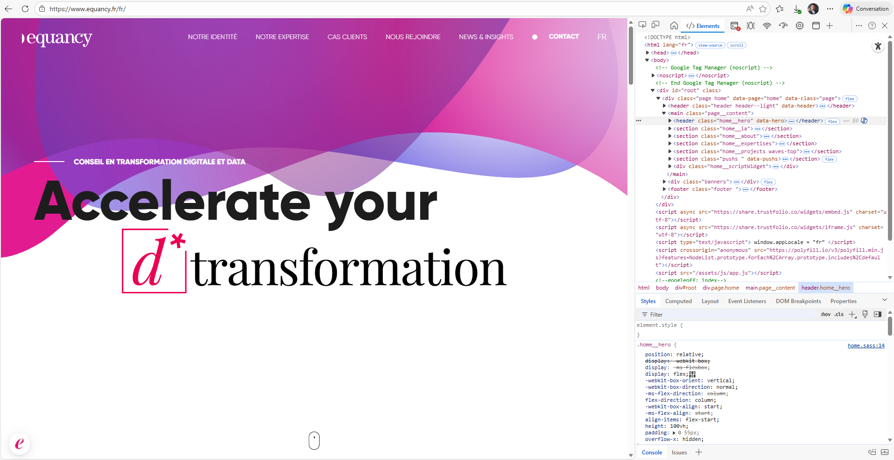
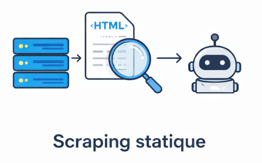
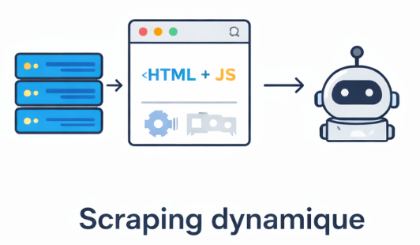
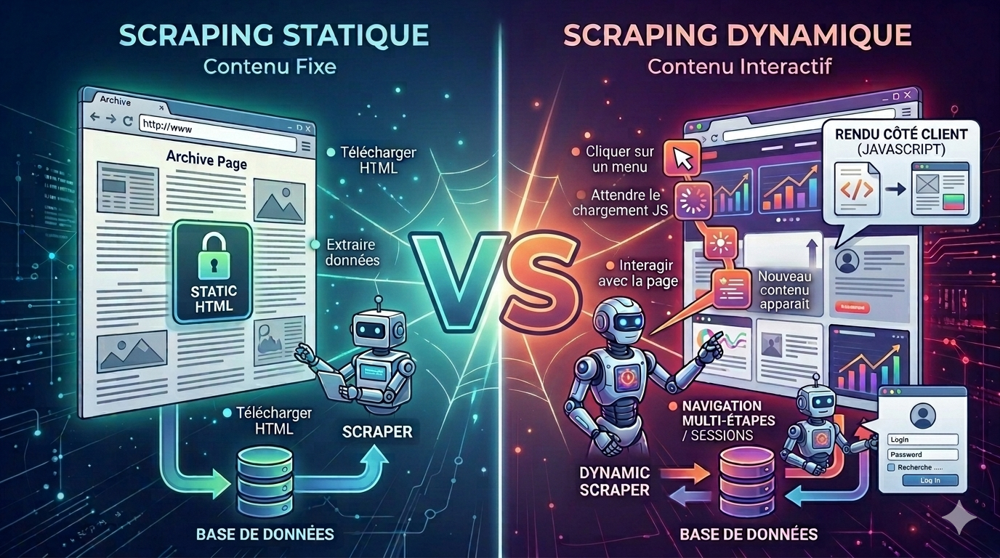

Nous avons vu dans la section précédente que le scraping consiste à extraire des données depuis une page web. Mais toutes les pages ne fonctionnent pas de la même manière.

Lorsqu'on souhaite récupérer des données sur un site web, il est important de comprendre **comment le contenu de la page est généré**.

On distingue généralement deux types de pages web :

- les pages **statiques**
- les pages **dynamiques**

Cette différence influence fortement **les techniques et les outils utilisés pour réaliser le scraping**.

---

## Le DOM (Document Object Model)

Avant d'aborder les techniques de scraping, il est nécessaire de comprendre comment les pages web sont structurées et manipulées par le navigateur. En effet, les données que l'on souhaite récupérer sont généralement situées dans une structure appelée **DOM (Document Object Model)**. Comprendre cette structure permet donc de mieux identifier où se trouvent les informations à extraire.

    

Le **DOM (Document Object Model)** est la représentation structurée d'une page web telle qu'elle est interprétée par le navigateur.

Lorsqu'une page web est chargée, le navigateur analyse le document HTML et le transforme en une **structure arborescente composée d'éléments appelés nœuds**. Chaque balise HTML devient alors un élément de cette structure.

Cette représentation permet aux navigateurs et aux scripts JavaScript **d'accéder, de modifier et de manipuler le contenu de la page**.

Par exemple, des éléments comme :

- les titres
- les paragraphes
- les images
- les liens
- les boutons

sont tous représentés dans le DOM.

Il peut également évoluer après le chargement initial de la page. Les scripts JavaScript peuvent ajouter, modifier ou supprimer des éléments, ce qui est très courant dans les pages web modernes.

Voici un exemple concret de DOM tel qu'il apparaît dans les outils de développement d'un navigateur :

<figure align="center">
  
  <figcaption>Structure du DOM visible dans les outils de développement du navigateur (de notre site equancy.fr)</figcaption>
</figure>

Sur cette capture, on distingue à gauche le **rendu visuel de la page** et à droite la **structure HTML correspondante** telle qu'elle est représentée dans le DOM. Chaque élément visible dans la page (titres, images, liens, blocs de contenu) correspond à un nœud dans cette arborescence.

Dans le contexte du scraping, les outils de scraping analysent le **DOM de la page** afin d'identifier les éléments contenant les données à extraire.

Une fois la structure du DOM comprise, il est possible d’identifier les éléments contenant les données à extraire. Toutefois, toutes les pages web ne génèrent pas leur contenu de la même manière, ce qui conduit à distinguer deux approches principales : le **scraping statique** et le **scraping dynamique**.

---

## Scraping statique

Le **scraping statique** consiste à extraire des données directement depuis le **code HTML initial** de la page.

    

Autrement dit, les informations sont directement incluses dans le document HTML que le navigateur reçoit. Elles ne nécessitent pas l'exécution de scripts supplémentaires pour apparaître.

### Fonctionnement

Le processus est généralement simple et repose sur la récupération directe du contenu HTML de la page. Le déroulement peut être résumé ainsi :

1. Le script envoie une requête HTTP vers une page web
2. Le serveur renvoie le HTML de la page
3. Le scraper analyse cet HTML
4. Les données sont extraites à partir des balises HTML

### Caractéristiques

Le scraping statique présente généralement les caractéristiques suivantes :

- les données sont présentes **directement dans le HTML**
- aucune interaction ou exécution de JavaScript n'est nécessaire pour accéder aux données
- le scraping est généralement **rapide et simple à mettre en place**
- la structure HTML est généralement **stable**
- les balises HTML et leurs attributs changent rarement de nom, ce qui permet d’écrire un code de scraping **plus robuste et plus durable dans le temps**

### Cas d’usage fréquents

Ce type de scraping est très courant sur :

- les blogs
- les sites d’actualités
- certains sites e-commerce
- les pages documentaires

Cependant, de nombreux sites modernes chargent leurs données dynamiquement à l’aide de JavaScript. Dans ces cas-là, une approche différente est nécessaire : le scraping dynamique.

---

## Scraping dynamique

Le **scraping dynamique** consiste à extraire des données depuis une page web dont le contenu est **généré ou modifié dynamiquement par le navigateur**, généralement à l’aide de **JavaScript**.

    

Dans ce type de page, le document HTML initial ne contient pas nécessairement toutes les informations visibles à l’écran. Lorsque la page se charge, des scripts s’exécutent dans le navigateur et peuvent déclencher des requêtes supplémentaires vers le serveur afin de récupérer des données.

Ces données sont ensuite **injectées dans le DOM de la page** et deviennent visibles pour l’utilisateur.

Le scraper doit donc être capable de **reproduire ou d’observer ce processus** afin d’accéder aux informations.

### Fonctionnement

Dans un contexte de page dynamique, le chargement des données se déroule généralement en plusieurs étapes :

1. Le navigateur charge la page initiale
2. Des scripts JavaScript s'exécutent
3. Ces scripts envoient des requêtes supplémentaires vers le serveur ou une API
4. Les données reçues sont injectées dans le DOM et deviennent visibles dans la page

Pour récupérer ces informations, le scraper doit donc attendre que ces étapes soient réalisées ou interagir avec la page comme le ferait un utilisateur.

### Caractéristiques

Le scraping dynamique présente généralement plusieurs caractéristiques :

- une partie du contenu est **chargée après le chargement initial de la page**
- la page repose fortement sur **JavaScript**
- certaines données apparaissent uniquement après **des interactions utilisateur** (clic, scroll, filtres, etc.) qu'il faudra simuler soi-même
- le scraping est généralement **plus complexe à mettre en place**
- la structure du DOM peut être **plus complexe ou instable**
- certaines balises ou classes peuvent être **générées dynamiquement**, ce qui peut rendre le scraping plus fragile. Leur nom peut changer d'une version à l'autre, ce qui nécessite des mises à jour et une veille régulière

### Cas d’usage fréquents

Ce type de fonctionnement est très courant sur :

- les applications web modernes
- les réseaux sociaux
- les sites web bêta
- les plateformes e-commerce complexes
- les dashboards interactifs

---

## Comment reconnaître une page dynamique

Plusieurs indices permettent d’identifier une page dynamique :

- certaines informations apparaissent **après quelques secondes**
- les données ne sont pas visibles dans le **code source initial**
- le site utilise fortement **JavaScript**
- certaines actions (clic, scroll, filtre) déclenchent le chargement de nouvelles données
- certaines données ne sont accessibles **qu'après authentification**

Dans ces situations, un simple scraping du HTML ne suffit généralement pas.

---

## Résumé

La différence entre scraping statique et dynamique ne dépend pas de l’outil utilisé, mais de **la manière dont les données sont générées et chargées dans la page**.

| Type de scraping | Description | Difficulté |
|------|------|------|
| Scraping statique | Les données sont directement présentes dans le HTML initial | faible |
| Scraping dynamique | Les données sont chargées ou générées après le chargement initial de la page | plus élevée |

    

| Approche | Flux |
|----------|------|
| Scraping statique | Serveur → HTML → données visibles |
| Scraping dynamique | Serveur → HTML → JavaScript → API → DOM → données visibles |

Le scraping statique est généralement **plus simple et plus rapide**, tandis que le scraping dynamique nécessite des outils capables d'**interagir avec la page comme le ferait un utilisateur**.

Quelle que soit l'approche utilisée, le scraping repose sur la capacité à **localiser les éléments dans la structure HTML** d'une page. Dans la section suivante, nous verrons les bases du HTML nécessaires pour comprendre comment cibler et extraire les données.
