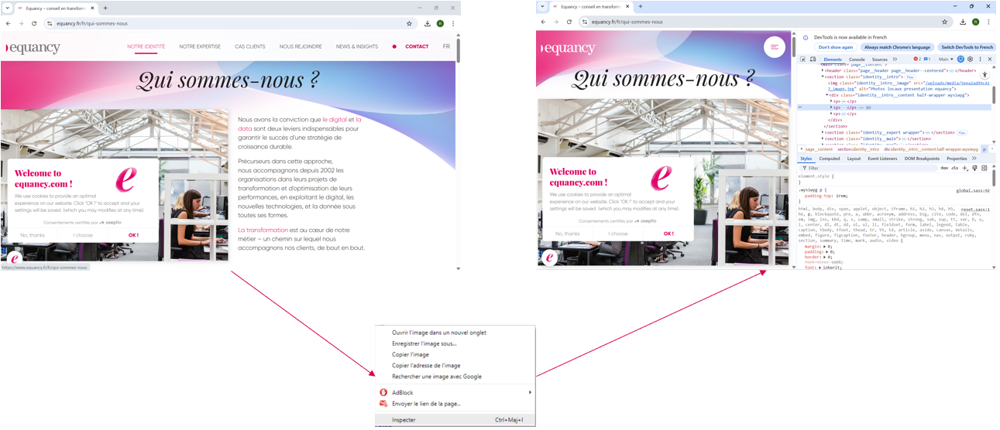

Pour réaliser un scraping, il est essentiel de comprendre **comment une page web est structurée** et **comment les données sont organisées dans le HTML**.

Les outils de scraping se basent en effet sur la structure du document HTML pour **localiser et extraire les informations**. Comprendre les balises, les attributs et l’organisation du DOM permet donc d’identifier plus facilement les données à récupérer.


# Les balises

Les pages web sont écrites en **HTML (HyperText Markup Language)**, un langage qui permet de structurer le contenu d’un document à l’aide de **balises**.

Ces balises indiquent au navigateur comment organiser et afficher les différents éléments d’une page.

Dans le contexte du scraping, les balises les plus fréquemment rencontrées sont `<div>`, `<span>`, `<a>`, `<table>`, `<ul>`/`<li>` et `<p>`, car ce sont elles qui contiennent généralement les données à extraire (textes, liens, listes, tableaux).


## Balises de Structure

Une page HTML suit généralement une structure similaire :

```html
<html>
  <head>
    <title>Titre de la page</title>
  </head>

  <body>
    <h1>Titre principal</h1>
    <p>Un paragraphe de texte</p>
    <a href="#">Un lien</a>
  </body>
</html>
```

Les balises de structure définissent l'organisation globale d'un document HTML : 


- `<html>` : La balise racine de tout document HTML.
- `<head>` : Contient des métadonnées sur le document, comme le titre et les liens vers les scripts et feuilles de style.
- `<body>` : Contient le contenu visible de la page web.
    
## Balises de Métadonnées

Ces balises fournissent des informations sur la page web et permettent de définir certaines ressources nécessaires à son fonctionnement.

- `<title>` : Définit le titre du document, affiché dans l'onglet du navigateur.
- `<meta>` : Spécifie les métadonnées comme le charset, description, mots-clés, etc.
- `<link>` : Utilisé pour lier des ressources externes comme les feuilles de style CSS.
- `<script>` : Utilisé pour inclure ou référencer des scripts JavaScript.
    
## Balises de Contenu

Les balises de contenu permettent de structurer et afficher les éléments principaux d'une page web.


- `<h1>` à `<h6>` : Définit les titres de sections, du plus important (`<h1>`) au moins important (`<h6>`).
- `<p>` : Définit un paragraphe de texte.
- `<a>` : Définit un lien hypertexte.
- `<ul>`, `<ol>`, `<li>` : Définissent des listes non ordonnées (`<ul>`) et ordonnées (`<ol>`), et les éléments de liste (`<li>`).
- `<div>` : Définit une section ou un conteneur générique, souvent utilisé pour la mise en page.
- `<span>` : Définit un conteneur générique en ligne pour le style du texte.
    
## Balises de Mise en Forme

Ces balises permettent de modifier l’apparence ou l’importance sémantique du texte dans une page.

- `<b>`, `<strong>` : Définissent du texte en gras, `<strong>` ajoutant une importance sémantique.
- `<i>`, `<em>` : Définissent du texte en italique, `<em>` ajoutant une importance sémantique.
- `<br>` : Insère un saut de ligne.
- `<hr>` : Insère une ligne horizontale.

## Balises de Médias

Les balises de médias permettent d’intégrer différents types de contenus multimédias dans une page web.

- `` : Insère une image.
- `<audio>` : Insère un contenu audio.
- `<video>` : Insère un contenu vidéo.
- `<source>` : Spécifie les sources pour les éléments `<audio>` et `<video>`.
    
## Balises de Formulaires

Les formulaires permettent aux utilisateurs de saisir et d’envoyer des données à un serveur.

- `<form>` : Définit un formulaire pour la saisie de l'utilisateur.
- `<input>` : Définit un champ de saisie de données.
- `<label>` : Définit une étiquette pour un élément de formulaire.
- `<button>` : Définit un bouton.
- `<select>`, `<option>` : Définit une liste déroulante et ses options.
- `<textarea>` : Définit une zone de texte multi-lignes.
    
## Balises de Tableaux

Les tableaux permettent d’organiser des données sous forme de lignes et de colonnes.

- `<table>` : Définit un tableau.
- `<tr>` : Définit une ligne de tableau.
- `<td>` : Définit une cellule de tableau.
- `<th>` : Définit une cellule d'en-tête de tableau.
- `<thead>`, `<tbody>`, `<tfoot>` : Définissent les sections d'en-tête, de corps et de pied de tableau.
    
## Balises Sémantiques

Les balises sémantiques donnent du sens à la structure d’une page et facilitent la compréhension de son organisation.

- `<header>` : Définit un en-tête pour un document ou une section.
- `<nav>` : Définit un ensemble de liens de navigation.
- `<main>` : Définit le contenu principal du document.
- `<section>` : Définit une section d'un document.
- `<article>` : Définit un contenu autonome qui pourrait être distribué indépendamment.
- `<aside>` : Définit un contenu quelque peu lié au contenu principal.
- `<footer>` : Définit un pied de page pour un document ou une section.
    
## Autres Balises Importantes

Certaines balises sont utilisées dans des cas spécifiques mais restent importantes à connaître.

- `<iframe>` : Intègre un autre document HTML dans le document courant.
- `<canvas>` : Utilisé pour dessiner des graphiques à la volée via JavaScript.
- `<svg>` : Définit des graphiques vectoriels.


# Les attributs HTML

Les **attributs HTML** sont des informations supplémentaires ajoutées à une balise HTML.  
Ils permettent de préciser certaines caractéristiques d’un élément, comme son identifiant, sa classe, son lien ou encore la source d’un média.

Les attributs sont placés **dans la balise d’ouverture** et sont généralement définis sous la forme :

```html
<a href="https://example.com" class="link">Lien</a>
```

Dans cet exemple :

* `<a>` est la balise
* `href` est un attribut qui définit l’adresse du lien
* `class` est un attribut permettant d’identifier ou de styliser l’élément

Dans le contexte du scraping, les attributs jouent un rôle essentiel car ils permettent **d’identifier précisément les éléments contenant les données à extraire**.

Les outils de scraping utilisent souvent ces attributs pour cibler des éléments dans le DOM à l’aide de **sélecteurs**.

Par exemple, on peut rechercher :

- un élément ayant une **classe spécifique**
- un élément possédant un **identifiant unique**
- un lien pointant vers une certaine URL
- une image provenant d’une source particulière

Les attributs constituent donc souvent **les repères utilisés pour localiser les données dans une page web**.

## Attributs fréquemment utilisés en scraping

Les attributs les plus utiles pour le scraping sont :

* `id` : identifie un élément unique dans la page
* `class` : permet de regrouper plusieurs éléments ayant un rôle similaire
* `href` : contient l’adresse d’un lien
* `src` : indique la source d’une image, d’une vidéo ou d’un script
* `data-*` : attributs personnalisés souvent utilisés pour stocker des données


## Exemple simplifié

Prenons un exemple : 

```html
<div class="product">
  <h2 class="product-title">Nom du produit</h2>
  <span class="price">19.99€</span>
  <a href="/product/123" class="product-link">Voir le produit</a>
</div>
```

Dans cet exemple :

* `class="product"` identifie un bloc produit
* `class="product-title"` permet d’identifier le nom du produit
* `class="price"` contient le prix
* `href="/product/123"` contient le lien vers la page du produit

Ces attributs vous permettent donc de repérer facilement les informations importantes dans la page.


# Inspecter les attributs dans une page web

Pour identifier les éléments contenant les données que l'on souhaite récupérer, il est nécessaire d'inspecter la structure HTML de la page.

Pour inspecter un élément dans une page web :

1. Faire un **clic droit** sur la page web
2. Cliquer sur **Inspecter** ou **Inspect**
3. Les outils de développement s’ouvrent et affichent la structure HTML de la page
4. Utiliser l’outil de sélection pour survoler l’élément souhaité
5. Sélectionner et faire un **clic droit** sur un élément spécifique
6. Cliquer sur **Inspecter** ou **Inspect**
7. L’élément sélectionné apparaît alors dans le **DOM**


<div align="center" markdown>
<div style="text-align: center;">
    
</div></div>


Une fois l’élément localisé dans le DOM, il est possible d’observer :

- la **balise HTML** utilisée
- les **classes** (`class`)
- les **identifiants** (`id`)
- les **liens** (`href`)
- les **sources de médias** (`src`)
- d'autres attributs personnalisés (`data-*`)

Ces informations permettent ensuite de construire des **sélecteurs** pour cibler précisément les éléments lors du scraping.

Voici une démonstration qui récapitule les étapes : 

<p align="center">
  
</p>


# Localiser les éléments avec les sélecteurs CSS et XPath

Une fois les éléments d'une page web inspectés et les attributs identifiés, il est nécessaire d'utiliser des **sélecteurs** pour cibler précisément ces éléments pour pouvoir interagir avec et/ou extraire les données qu'ils contiennent.

Parmi ces différentes méthodes, **les sélecteurs CSS et les XPath sont les plus utilisés dans le scraping** car ils permettent de cibler précisément les éléments dans le DOM.

Les sélecteurs CSS sont utilisés à l’origine pour appliquer des styles aux pages web, mais ils sont également très utilisés dans le scraping pour **localiser les données à extraire**.

Les **XPath**, quant à eux, permettent de naviguer plus précisément dans la structure du DOM.

Le tableau ci-dessous présente quelques exemples courants de sélecteurs CSS et XPath utilisés pour cibler des éléments dans une page web : 

| Objectif | HTML type | Sélecteur CSS | XPath |
|----------|-----------|---------------|-------|
| Sélection par balise | `<p>Texte</p>` | `p` | `//p` |
| Sélection par classe | `<span class="price">19€</span>` | `.price` | `//span[@class="price"]` |
| Sélection par identifiant | `<h1 id="title">Produit</h1>` | `#title` | `//*[@id="title"]` |
| Balise + classe | `<span class="price">19€</span>` | `span.price` | `//span[@class="price"]` |
| Navigation dans le DOM | `<div><span>Texte</span></div>` | `div span` | `//div/span` |
| Attribut spécifique | `<a href="/produit">Voir</a>` | `a[href]` | `//a[@href]` |


Dans la pratique, les sélecteurs CSS et XPath sont les méthodes les plus courantes pour localiser des éléments dans une page web.

Certains outils d’automatisation comme `Selenium` proposent également d'autres stratégies de localisation des éléments, que nous verrons dans la section dédiée.

## Récapitulatif 


| Critère | Sélecteurs CSS | XPath |
|--------|---------------|-------|
| Lisibilité | Simple et facile à lire | Plus complexe à lire |
| Syntaxe | Courte et intuitive | Plus verbeuse |
| Navigation dans le DOM | Limitée (descendante principalement) | Très puissante (parent, enfant, ancêtres…) |
| Performance | Généralement plus rapide | Légèrement plus lent mais plus flexible |
| Utilisation en scraping | Très courant (BeautifulSoup, Playwright, etc.) | Souvent utilisé avec Selenium |
| Facilité d’apprentissage | Facile | Plus difficile |
| Cas d’usage | Cibler rapidement des éléments via `class` ou `id` | Naviguer précisément dans une structure complexe |

Dans la pratique, le choix entre sélecteurs CSS et XPath dépend souvent de la structure de la page web et de l’outil utilisé pour le scraping.

**NB** :
On utilise très souvent **les classes (`class`) et les identifiants (`id`)** pour cibler les éléments contenant les données. Lorsque ces repères ne suffisent pas ou que l’on doit naviguer plus précisément dans la structure du **DOM**, il est possible d’utiliser des **XPath**.


Pour résumer, le processus d'extraction de données à partir d'une page web peut être synthétisé ainsi :

    Page web => HTML => DOM => Sélecteurs => Extraction des données

Maintenant que les bases du HTML sont posées, nous allons voir dans la section suivante comment un script ou un navigateur communique avec un serveur web pour récupérer le contenu d'une page : les **requêtes HTTP**.

