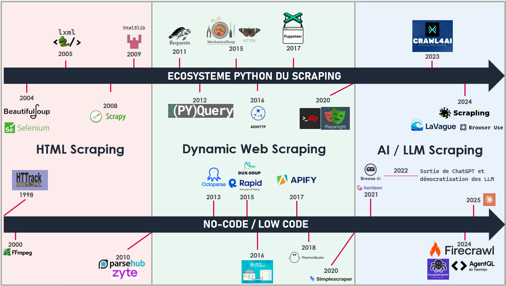

Le web scraping a évolué en parallèle de l’évolution du web lui-même.
À mesure que les technologies web ont gagné en complexité, les techniques et les outils permettant d’extraire des données ont également évolué.

On peut distinguer trois grandes phases dans l’histoire du scraping :

* le scraping de pages HTML statiques
* le scraping de sites dynamiques
* le scraping assisté par l’IA

La frise ci-dessous illustre l’évolution des principaux outils et technologies utilisés dans l’écosystème du scraping :

<h2 align="center">Chronologie de l'évolution du Web Scraping</h2>

  

**Remarque** : Selenium est l’un des rares outils du web scraping apparu il y a plus de 20 ans et qui reste encore largement utilisé aujourd’hui.

---

# 1. L’ère du HTML Scraping (années 2000)

Au début des années 2000, la majorité des sites web étaient constitués de **pages HTML statiques**. Les données visibles dans le navigateur étaient directement présentes dans le code HTML renvoyé par le serveur.

Dans ce contexte, le scraping consistait principalement à :

1. récupérer une page web  
2. analyser son HTML  
3. extraire les informations souhaitées  

Plusieurs bibliothèques Python sont apparues pour faciliter cette tâche.

**Exemples notables :**

- **BeautifulSoup (2004)** : bibliothèque permettant de parser et naviguer dans le HTML  
- **lxml (2005)** : parser HTML et XML très performant  
- **html5lib (2009)** : parser conforme aux spécifications HTML5  
- **Scrapy (2008)** : framework complet de crawling et scraping  

Ces outils ont rendu possible l’extraction automatique de données à partir de la structure HTML des pages.

---

# 2. L’ère du Dynamic Web Scraping (années 2010)

À partir des années 2010, le web évolue vers des **applications web dynamiques**. Les sites utilisent de plus en plus :

- **JavaScript**
- **AJAX**
- des frameworks comme **React**, **Angular** ou **Vue**

Dans ces cas-là, une partie du contenu n’est plus présente dans le HTML initial mais est **chargée dynamiquement dans le navigateur**.

Le scraping devient alors plus complexe, car il faut parfois **simuler le comportement d’un utilisateur**.

Plusieurs outils apparaissent pour répondre à ces nouveaux besoins :

- **Requests (2011)** : simplifie les requêtes HTTP en Python  
- **PyQuery (2012)** : manipulation du DOM inspirée de jQuery  
- **aiohttp (2016)** : requêtes HTTP asynchrones  
- **HTTPX (2015)** : client HTTP moderne  
- **Selenium (2004)** : déjà apparu durant l'ère précédente, Selenium s'est imposé comme un outil incontournable pour le scraping dynamique grâce à sa capacité à automatiser un navigateur  
- **Puppeteer (2017)** : automatisation de Chrome  
- **Playwright (2020)** : automatisation multi-navigateurs  

Ces outils permettent de reproduire les interactions d’un utilisateur avec une page web et d’accéder aux données générées dynamiquement.

---
# 3. L’ère de l'AI / LLM Scraping (années 2020)

Depuis le début des années 2020, l’essor de l’intelligence artificielle et des **modèles de langage (LLM)** a profondément transformé le paysage du scraping.

Les outils récents ne se contentent plus de récupérer des données : ils cherchent également à **structurer et exploiter l’information pour des systèmes d’IA**.

L’année **2022**, marquée par la sortie de **ChatGPT**, marque un tournant dans la démocratisation de ces technologies.

De nouveaux outils apparaissent pour faciliter l’extraction et la préparation de données destinées aux modèles d’IA :

- **Crawl4AI (2023)** : crawling et extraction orientés LLM  
- **Scrapling (2024)** : bibliothèque moderne de scraping Python  
- **Firecrawl (2024)** : extraction de contenu optimisée pour l’ingestion par des modèles d’IA  
- **AgentQL (2024)** : interrogation de pages web via des requêtes structurées  

Parallèlement, de nombreuses plateformes **no-code** permettent désormais de réaliser du scraping sans écrire de code.

**Exemples :**

- ParseHub  
- Octoparse  
- PhantomBuster  
- Browse AI  
- Apify  

Ces outils rendent le scraping accessible à un public plus large et permettent d’automatiser l’extraction de données à grande échelle.

---

# Conclusion

L’histoire du scraping reflète directement l’évolution du web :

| Période | Type de web | Approche du scraping |
|--------|-------------|----------------------|
| 2000–2010 | Pages HTML statiques | Parsing du HTML |
| 2010–2020 | Applications web dynamiques | Automatisation de navigateurs |
| 2020–aujourd’hui | Web orienté IA | Scraping assisté par l’IA |

Aujourd’hui, les outils de scraping continuent d’évoluer afin de s’adapter aux nouvelles architectures web et aux besoins croissants en données.

Dans la section suivante, nous détaillerons les principaux modules Python utilisés pour le scraping et leurs cas d’usage.