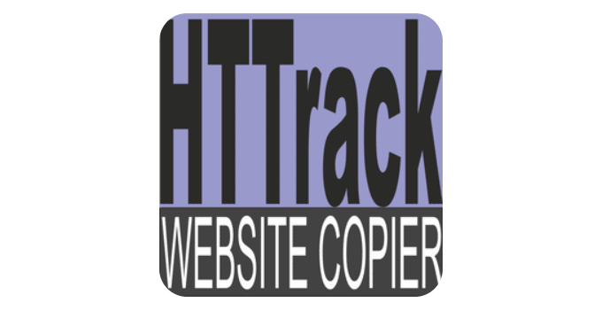

Le scraping web ne se limite pas aux bibliothèques de programmation comme celles présentées précédemment.  
Il existe également de nombreux **outils no-code ou low-code** permettant de collecter des données sur le web **sans écrire de code**.

Ces outils proposent généralement une interface graphique permettant de :

- sélectionner des éléments directement dans une page web
- automatiser des interactions (clic, navigation, formulaires)
- extraire des données structurées
- planifier des tâches de scraping

Ils sont particulièrement utiles pour :

- les **analystes de données**
- les **équipes marketing**
- les **équipes business**
- les utilisateurs ne souhaitant pas développer de scripts Python.

# Principaux outils no-code

| Outil | Type | Description | Cas d’usage |
|------|------|------|------|
| `PhantomBuster` | Automatisation web | plateforme d’automatisation permettant d’exécuter des scripts pour collecter des données sur différents services web | extraction de données sur les réseaux sociaux |
| `Octoparse` | Scraping visuel | outil de scraping basé sur une interface graphique permettant de sélectionner les éléments à extraire | scraping de sites e-commerce |
| `ParseHub` | Scraping visuel | outil permettant de créer des scrapers via une interface graphique capable de gérer des pages dynamiques | extraction de données complexes |
| `Apify` | Plateforme d’automatisation | plateforme permettant de créer et exécuter des scrapers et des automatisations web | scraping à grande échelle |
| `Zyte` | Scraping platform | solution complète de scraping développée par l’équipe derrière Scrapy | scraping industriel |
| `Browse AI` | Automatisation web | outil permettant d’extraire des données depuis des pages web et de surveiller les changements | monitoring de sites web |

# Automatisation de bureau (RPA)

En complément des outils dédiés au scraping web, une famille d'outils plus large existe : les plateformes de **RPA (Robotic Process Automation)**. Ces outils permettent d'automatiser des interactions non seulement avec un navigateur, mais avec **n'importe quelle application du bureau** (Excel, logiciels métiers, SAP, portails sans API, etc.).

Contrairement aux outils de scraping présentés précédemment, les outils RPA interagissent avec l'**interface graphique** du système d'exploitation : ils simulent des clics, des saisies clavier, de la navigation dans des menus — et peuvent inclure la navigation web comme une étape parmi d'autres dans un workflow plus large.

| Outil | Éditeur | Points clés | Cas d'usage |
|-------|---------|-------------|-------------|
| `UiPath` | UiPath Inc. | leader du marché, interface visuelle Studio, cloud et on-premise | automatisation de processus métiers, extraction depuis des portails web |
| `Power Automate Desktop` | Microsoft | intégré à Windows 10/11, gratuit, connecteurs Microsoft 365 natifs | tâches bureautiques répétitives, extraction de données web |
| `Automation Anywhere` | Automation Anywhere | cloud-native, IA intégrée (IQ Bot), orienté grande entreprise | automatisation à grande échelle, traitement de documents structurés |

Ces outils sont particulièrement adaptés lorsque :

- les données à extraire proviennent d'une **application de bureau** (et non d'un site web accessible par HTTP)
- le flux de travail combine **navigation web et manipulations bureautiques** (copier des données d'un site vers Excel, par exemple)
- l'équipe ne dispose pas de compétences en programmation mais doit automatiser des processus récurrents

> **Note** : les outils RPA sont avant tout conçus pour l'automatisation de processus métiers complets. Pour des besoins purement de collecte de données web à grande échelle, les outils de scraping présentés ci-dessus (Octoparse, ParseHub, Apify…) restent généralement plus adaptés.

---

# Bookmarklets

Un **bookmarklet** est un petit programme JavaScript stocké comme un favori (bookmark) dans le navigateur. Lorsqu'on clique dessus dans la barre des favoris, il exécute le script directement sur la page web affichée — sans aucune installation ni serveur.

Du point de vue de l'automatisation et du scraping, les bookmarklets permettent de :

- **extraire rapidement des données** d'une page (textes, liens, tableaux, images...)
- **automatiser des actions simples** (cliquer sur un bouton, remplir un champ, déclencher un téléchargement)
- **copier des informations** dans le presse-papier en un clic
- **inspecter ou modifier** l'affichage d'une page à la volée

## Créer un bookmarklet

Un bookmarklet se crée en ajoutant un favori dont l'URL est un code JavaScript précédé de `javascript:` :

```javascript
javascript:(function(){
  var links = document.querySelectorAll('a');
  var urls = Array.from(links).map(a => a.href).join('\n');
  alert('Liens trouvés : ' + links.length + '\n\n' + urls);
})();
```

Ce bookmarklet extrait tous les liens de la page et les affiche dans une alerte. Il suffit de copier ce code comme URL d'un nouveau favori pour l'utiliser sur n'importe quel site.

## Avantages et limites

| Aspect | Détail |
|--------|--------|
| ✅ Sans installation | fonctionne dans tous les navigateurs, pas de store, pas de plugin |
| ✅ Accès au DOM complet | récupère aussi les données chargées dynamiquement par JavaScript |
| ✅ Partage facile | s'exporte/importe comme un simple lien |
| ❌ Limites techniques | code limité en taille, pas de requêtes vers des domaines externes (CORS) |
| ❌ Non adapté au volume | pas de persistance, pas d'automatisation sans intervention manuelle |

Les bookmarklets sont particulièrement utiles pour des extractions **ponctuelles et manuelles**, là où écrire un script complet ou utiliser un outil dédié serait disproportionné.

---

# Extensions Chrome / Edge pour l'automatisation et le scraping

Les **extensions de navigateur** constituent une approche plus complète que les bookmarklets. Installées une fois dans Chrome ou Edge, elles s'exécutent dans le navigateur avec un accès permanent au DOM des pages visitées, aux cookies et à la session utilisateur.

## Extensions de scraping existantes

Plusieurs extensions dédiées au scraping sont disponibles directement dans les stores officiels et ne nécessitent aucune programmation :

| Extension | Navigateur | Description |
|-----------|-----------|-------------|
| `Web Scraper` | Chrome, Edge, Firefox | crée des "sitemaps" de scraping via une interface graphique dans les DevTools ; gère la pagination et la navigation |
| `Data Miner` | Chrome, Edge | extrait des tableaux et données structurées depuis des pages web, export CSV/Excel |
| `Instant Data Scraper` | Chrome, Edge | détection automatique des données tabulaires sur une page, export immédiat en un clic |
| `Agenty` | Chrome | scraping avec gestion de la pagination, des clics et des formulaires |

## Développer sa propre extension

Il est également possible de **créer sa propre extension** Chrome ou Edge pour automatiser des actions ou extraire des données spécifiques. Une extension est constituée de plusieurs fichiers :

- un **`manifest.json`** déclarant les permissions et les scripts
- un ou plusieurs **content scripts** s'exécutant dans le contexte des pages web
- éventuellement un **background script** pour les tâches persistantes et un **popup** pour l'interface

```json
// manifest.json (simplifié — Manifest V3)
{
  "manifest_version": 3,
  "name": "Mon Scraper",
  "version": "1.0",
  "permissions": ["activeTab", "scripting", "storage"],
  "action": {
    "default_popup": "popup.html"
  },
  "content_scripts": [{
    "matches": ["<all_urls>"],
    "js": ["content.js"]
  }]
}
```

```javascript
// content.js — s'exécute dans la page web et récupère des données
const items = document.querySelectorAll('.product-title');
const titles = Array.from(items).map(el => el.textContent.trim());
chrome.runtime.sendMessage({ titles: titles });
```

## Avantages et limites des extensions

| Aspect | Détail |
|--------|--------|
| ✅ Accès complet au DOM | récupère les données chargées dynamiquement par JavaScript |
| ✅ Session utilisateur | accès aux cookies et à l'authentification de l'utilisateur |
| ✅ Intégré au navigateur | pas de navigateur externe à piloter (contrairement à Selenium) |
| ❌ Interaction manuelle | l'utilisateur doit naviguer sur le site cible (pas de scraping headless) |
| ❌ Distribution | nécessite une publication sur le Chrome Web Store pour partager largement |
| ❌ Volume limité | peu adapté au scraping massif ou entièrement automatisé |

> **Quand choisir une extension ?** Les extensions Chrome/Edge sont particulièrement adaptées aux extractions **interactives** où l'utilisateur navigue lui-même sur le site. Pour du scraping automatisé sans intervention humaine, Playwright ou Selenium restent plus appropriés.

---

# Fonctionnement général

La plupart des outils no-code fonctionnent selon une logique similaire :

1. L’utilisateur ouvre une page web dans l’interface de l’outil
2. Il sélectionne les éléments contenant les données à extraire
3. L’outil génère automatiquement les sélecteurs nécessaires
4. Le scraping peut ensuite être exécuté ou planifié

Certains outils permettent également de :

- gérer la **pagination**
- automatiser des **clics ou des formulaires**
- exporter les données vers **CSV, Excel ou API**

# Avantages des outils no-code

Les outils no-code présentent plusieurs avantages :

- prise en main rapide
- aucune connaissance en programmation nécessaire
- création rapide de scrapers simples
- intégration avec des outils métiers

Ils peuvent donc être particulièrement utiles pour **prototyper rapidement une collecte de données**.

# Limites

Cependant, ces outils présentent aussi certaines limites :

- moins de flexibilité que les solutions programmatiques
- gestion plus difficile des cas complexes
- coûts parfois élevés pour les volumes importants
- dépendance à une plateforme externe

Dans les projets de scraping avancés ou nécessitant une forte personnalisation, les bibliothèques de programmation comme **Scrapy**, **Playwright** ou **Selenium** restent généralement privilégiées.

---

# Alternatives au scraping : avez-vous vraiment besoin de scraper ?

Avant de mettre en place un scraper (qu'il soit no-code ou programmatique), il est important de vérifier si les données recherchées ne sont pas déjà **accessibles par des voies plus simples, plus fiables et plus respectueuses des sources**.

Dans de nombreux cas, le scraping n'est pas la meilleure option. Trois alternatives méritent d'être systématiquement envisagées.

## API officielles

De nombreux services web proposent des **API officielles** permettant d'accéder à leurs données de manière structurée, documentée et autorisée.

Utiliser une API officielle présente plusieurs avantages par rapport au scraping :

- les données sont **structurées** (JSON, XML) et prêtes à l'emploi
- l'accès est **autorisé et encadré** par le fournisseur
- les résultats sont **stables** : pas de risque de casse si le design du site change
- la **documentation** facilite l'intégration

| Service | API disponible | Exemple de données accessibles |
|---------|---------------|-------------------------------|
| Google Maps | Google Maps Platform API | lieux, avis, itinéraires, géocodage |
| Twitter / X | X API (v2) | tweets, profils, tendances |
| LinkedIn | LinkedIn Marketing API | données entreprises, campagnes |
| INSEE | API Sirene, API données locales | données entreprises, statistiques territoriales |
| Météo-France | API Météo-France | prévisions, données climatiques |
| OpenStreetMap | Overpass API, Nominatim | données cartographiques, géocodage |

> **Bonne pratique** : avant de scraper un site, vérifier s'il propose une API en consultant sa documentation développeur ou en cherchant `site:exemple.com API` ou `site:exemple.com/developers`.

## Flux RSS

Les **flux RSS** (Really Simple Syndication) sont un format standardisé permettant de suivre les mises à jour d'un site web de manière automatisée. Beaucoup de sites d'actualités, blogs et plateformes institutionnelles en proposent encore.

Un flux RSS fournit généralement :

- le **titre** de chaque article ou publication
- un **résumé** ou le contenu complet
- la **date de publication**
- le **lien** vers la page d'origine

Les flux RSS sont exploitables en Python avec des bibliothèques comme `feedparser` :

```python
import feedparser

feed = feedparser.parse("https://www.lemonde.fr/rss/une.xml")
for entry in feed.entries:
    print(entry.title, entry.link)
```

> **Astuce** : pour vérifier si un site propose un flux RSS, chercher une icône RSS sur le site, consulter le code source (`<link type="application/rss+xml">`), ou tester des URL classiques comme `/rss`, `/feed`, `/atom.xml`.

## Open Data

L'**Open Data** (données ouvertes) désigne les données mises à disposition librement par des organisations publiques ou privées, dans des formats exploitables et sous des licences permissives.

En France et en Europe, de nombreuses plateformes centralisent ces données :

| Plateforme | Périmètre | Exemples de jeux de données |
|-----------|-----------|----------------------------|
| [data.gouv.fr](https://www.data.gouv.fr) | France — données publiques | base SIRENE, résultats électoraux, données de santé, transports |
| [data.europa.eu](https://data.europa.eu) | Union Européenne | statistiques Eurostat, données environnementales, données économiques |
| [INSEE](https://www.insee.fr/fr/statistiques) | France — statistiques | recensement, emploi, revenus, démographie |
| [OpenDataSoft](https://public.opendatasoft.com) | Multi-sources | données urbaines, transports, énergie |
| [Kaggle Datasets](https://www.kaggle.com/datasets) | International | jeux de données variés, souvent prêts à l'analyse |

L'Open Data est particulièrement pertinent lorsque l'on cherche des **données institutionnelles, statistiques ou géographiques** : plutôt que de scraper le site de l'INSEE ou d'une mairie, il est souvent plus efficace de télécharger directement le jeu de données depuis la plateforme Open Data correspondante.

> **Bonne pratique** : les portails Open Data proposent généralement des **API** en plus du téléchargement direct, ce qui permet d'automatiser la récupération des données sans scraping.

## Quand le scraping reste nécessaire

Le scraping reste la bonne approche lorsque :

- le site **ne propose ni API, ni flux RSS, ni données ouvertes**
- les données sont **spécifiques à une page web** (prix, disponibilité, contenu éditorial)
- on a besoin de **surveiller des changements** sur un site qui ne propose pas de notifications
- les données sont **publiques mais non structurées** et nécessitent une extraction ciblée

L'idée n'est pas de renoncer au scraping, mais de **vérifier d'abord les alternatives** : elles sont souvent plus rapides à mettre en place, plus stables dans le temps et juridiquement plus sûres.

---

# Services de scraping et API prêtes à l'emploi

Certaines plateformes vont plus loin que les outils no-code en proposant des **API de scraping prêtes à l'emploi**. Plutôt que de configurer un scraper soi-même, l'utilisateur interroge directement une API qui se charge de l'extraction des données.

Ce type de service est particulièrement intéressant lorsque :

- le site cible est difficile à scraper (anti-bot, captchas, contenu dynamique)
- on souhaite une solution rapide sans développer de scraper
- on a besoin de passer à l'échelle sans gérer l'infrastructure

## Apify

[`Apify`](https://apify.com/) est l'une des plateformes les plus connues dans ce domaine. Elle propose un catalogue de scrapers prêts à l'emploi appelés **Actors**, chacun conçu pour extraire des données depuis un site ou un service spécifique.

Par exemple, il existe des Actors pour :

- scraper les résultats de Google
- extraire des données depuis Instagram, Twitter ou LinkedIn
- collecter les avis depuis TripAdvisor ou Google Maps
- récupérer les prix depuis des sites e-commerce

L'utilisateur configure l'Actor (URL cible, paramètres de recherche, volume de données), lance l'extraction, puis récupère les résultats au format JSON, CSV ou via une API.

Apify permet également de **créer ses propres Actors** en JavaScript ou Python et de les déployer sur la plateforme, ce qui en fait un outil à la fois no-code et low-code.

## RapidAPI

[`RapidAPI`](https://rapidapi.com/) est une marketplace qui regroupe des milliers d'API, dont de nombreuses dédiées au scraping. Elle permet de rechercher, tester et consommer des API de scraping proposées par différents fournisseurs, le tout depuis une interface unifiée.

Par exemple, on y trouve des API pour extraire des données depuis LinkedIn, Amazon, Google Maps ou encore des sites d'actualités. L'avantage est de pouvoir comparer plusieurs fournisseurs pour un même besoin et de centraliser la gestion des clés API.

## Zyte

[`Zyte`](https://www.zyte.com/) (anciennement Scrapinghub, développé par l'équipe derrière Scrapy) propose une **API d'extraction automatique** capable de retourner les données structurées d'une page web à partir d'une simple URL, sans avoir à écrire de sélecteurs.

## Avantages de ces services

- pas besoin de gérer l'infrastructure (proxies, rotation d'IP, navigateurs)
- gestion automatique des mécanismes anti-bot
- API structurées, faciles à intégrer dans un pipeline de données
- passage à l'échelle simplifié

## Limites

- coût qui peut augmenter rapidement avec le volume de données
- dépendance à une plateforme externe
- moins de contrôle sur le processus d'extraction
- les Actors ou API peuvent devenir obsolètes si le site cible change

---

# Focus : PhantomBuster et le scraping de LinkedIn

<p align="center">
  
</p>

[`PhantomBuster`](https://phantombuster.com/) est particulièrement connu pour ses fonctionnalités d’automatisation sur les **réseaux sociaux professionnels**, notamment **LinkedIn**.

Le scraping de LinkedIn est souvent difficile à réaliser avec des scripts classiques pour plusieurs raisons :

- détection des bots
- limitation du nombre de requêtes
- captchas
- vérifications comportementales
- blocage d’adresses IP

Ces mécanismes rendent les scrapers traditionnels relativement faciles à détecter.

PhantomBuster contourne en partie ces limitations car il fonctionne différemment d’un scraper classique.

Au lieu d’envoyer des requêtes directement vers le serveur de LinkedIn, PhantomBuster agit comme **une automatisation du navigateur d’un utilisateur réel**.

Le fonctionnement est généralement le suivant :

1. l’utilisateur connecte son compte LinkedIn
2. PhantomBuster utilise la **session authentifiée de l’utilisateur**
3. l’outil automatise la navigation comme le ferait un humain
4. les données sont récupérées depuis les pages visitées

Autrement dit, PhantomBuster ne se comporte pas comme un robot qui envoie des requêtes massives vers les serveurs de LinkedIn.  
Il reproduit plutôt **le comportement d’un utilisateur naviguant sur la plateforme**.

Cette approche rend la détection plus difficile que dans le cas d’un scraping HTTP classique.

Cependant, il est important de noter que l’utilisation de ce type d’outil peut **rester soumise aux conditions d’utilisation de la plateforme**.

---

# Aspirateurs de sites web

Une autre catégorie d’outils souvent associée au scraping est celle des **aspirateurs de sites web**.

Contrairement aux outils présentés précédemment, ces logiciels ne cherchent pas forcément à extraire des données spécifiques.  
Leur objectif est plutôt de **copier une partie ou la totalité d’un site web afin de pouvoir le consulter hors ligne**.

Ils fonctionnent généralement en :

1. parcourant les liens d’un site web
2. téléchargeant les pages HTML
3. récupérant les images, feuilles de style et scripts
4. reconstruisant localement la structure du site

Ces outils sont donc très proches du **crawling**.

## Exemple : HTTrack


<p align="center">
  
</p>

[`HTTrack`](https://www.httrack.com/) est l’un des aspirateurs de sites web les plus connus et les plus utilisés.  
Il s’agit d’un logiciel permettant de **télécharger tout ou partie d’un site web afin d’en créer une copie locale**.

Concrètement, l’outil explore automatiquement les pages d’un site en suivant les liens internes, télécharge les ressources associées (pages HTML, images, feuilles de style, scripts, fichiers téléchargeables) et **reconstruit localement l’arborescence du site**.  
Une fois l’opération terminée, il est possible de naviguer dans cette copie du site **comme si l’on était en ligne**.

Ce type d’outil peut être utile dans plusieurs situations. Par exemple, il permet de **consulter un site hors ligne**, d’en **analyser la structure technique**, ou encore de **récupérer un grand nombre de ressources publiques** disponibles sur un site web.  
Il est notamment utilisé pour l’archivage de sites, l’analyse SEO ou encore la collecte massive de fichiers présents sur un site (par exemple des documents PDF).

Cependant, les aspirateurs de sites présentent aussi certaines limites.  
Contrairement aux outils de scraping, ils ne sont pas conçus pour **extraire des données précises et structurées** à partir des pages. Leur objectif est plutôt de **copier l’intégralité du contenu accessible**, ce qui peut conduire à télécharger une grande quantité de données inutiles.

De plus, ces outils fonctionnent principalement sur des sites **dont le contenu est directement accessible dans le HTML**. Les sites modernes reposant fortement sur JavaScript ou sur des requêtes dynamiques peuvent être plus difficiles à aspirer correctement.

Pour ces raisons, les aspirateurs de sites sont aujourd’hui souvent utilisés **en complément d’outils de scraping plus spécialisés**, qui permettent de cibler précisément les données à extraire.

Il est toutefois important de noter que les aspirateurs de sites web constituent, par nature, une forme de **scraping à grande échelle** : ils parcourent et téléchargent un volume important de pages de manière automatisée. À ce titre, ils partagent certaines problématiques communes avec les solutions de scraping industriel, comme la gestion du volume de données ou le respect des limites imposées par les serveurs.

Ces problématiques sont détaillées dans la section suivante, consacrée au [scraping à grande échelle](10 Le Scraping à grande échelle).